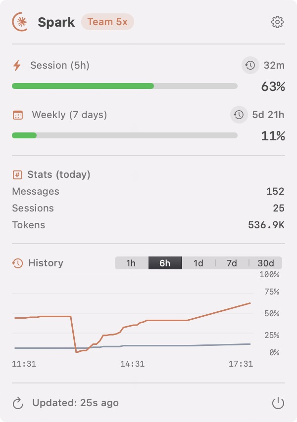

<p align="center">
  
</p>

<h1 align="center">Spark</h1>

<p align="center">
  A native macOS menu bar app that shows your Claude Code usage at a glance — color-coded, always visible, zero friction.
</p>

<p align="center">
  <a href="https://konradmichalik.github.io/spark/"></a>
  
  
  
</p>

---

<p align="center">
  
</p>

> **Why another usage app?**
> There are several Claude Code usage tools already — and some are great. Spark exists because none of them checked all my boxes: a menu bar icon that doubles as a live usage gauge, session projections, usage history across time ranges, and smart polling that stays out of the way. So I built exactly what I wanted — entirely with Claude Code.

> [!NOTE]
> Spark reads the OAuth token stored by Claude Code CLI in the macOS Keychain. No browser session cookies, no web scraping, no extra setup beyond a working `claude auth login`.

---

## ✨ Features

- **Usage ring** in the menu bar that fills based on current usage — ring color shifts green → orange → red as you approach your limit
- **Account tier badge** showing your plan (Pro, Max, Team, etc.) directly in the popover header
- **Session, Weekly & Sonnet usage** with progress bars and countdown timers to the next reset
- **Session projection** that estimates whether you'll hit the limit before the reset window closes
- **Usage history graph** with time-proportional rendering, hover tooltips, and selectable ranges (1h / 6h / 1d / 7d / 30d)
- **Today's stats** — message count, session count, and token totals at a glance
- **Claude service status** pulled from `status.anthropic.com` — only surfaces when there's an active incident
- **Native notifications** for warning thresholds, critical levels, limit resets, and service incidents
- **Smart refresh** that adapts polling from 5 min (active) down to 30 min (idle) and snaps back instantly when usage changes
- **Customizable icon** — Minimal, Dot, or Logo style; colored or monochrome
- **Auto-connect** via Claude Code CLI credentials from macOS Keychain

## 🔥 Installation

### Homebrew

```bash
brew install konradmichalik/tap/spark
```

To update to the latest version:

```bash
brew upgrade --cask konradmichalik/tap/spark
```

### Requirements

- macOS 14.0 (Sonoma) or later
- [Claude Code CLI](https://docs.anthropic.com/en/docs/claude-code) installed and authenticated

> Want to build from source? See [docs/DEVELOPMENT.md](docs/DEVELOPMENT.md).

## 🚀 Getting Started

Spark auto-detects your Claude Code credentials on first launch. If the connection doesn't happen automatically:

1. Click the menu bar icon to open the popover
2. Go to **Settings → Connection**
3. Click **Load Credentials**

If you haven't authenticated with Claude Code yet:

```bash
claude auth login
```

> [!TIP]
> After a successful `claude auth login`, Spark will pick up the credentials automatically on the next refresh — no restart needed.

## 💡 Usage

### Menu Bar Icon

The icon reflects your highest current usage level:

| Color | Meaning |
|-------|---------|
| Green | Below warning threshold (default < 75%) |
| Orange | Warning level (default 75–90%) |
| Red | Critical level (default > 90%) |

Click the icon to open the detailed popover with usage stats, the history graph, and service status.

### Smart Refresh

| Tier | Interval | Trigger |
|------|----------|---------|
| Active | 5 min | Usage is changing |
| Idle | 10 min | No change for 3 cycles |
| Idle+ | 15 min | No change for 6 cycles |
| Sleep | 30 min | No change for 10+ cycles |

> [!TIP]
> Smart refresh drops back to **Active** instantly the moment a usage change is detected, so you never miss a spike.

## 🐛 Troubleshooting

**No data / "Not connected" state**
Run `claude auth login` to ensure valid credentials exist, then use **Settings → Connection → Load Credentials**.

**Usage figures look stale**
Check the refresh mode in **Settings → General**. In Smart mode, the interval can stretch to 30 min during idle periods. Switch to a fixed interval if you need more frequent updates.

## 🧑‍💻 Contributing

See [docs/DEVELOPMENT.md](docs/DEVELOPMENT.md) for setup, architecture, and release instructions.

## 📜 License

MIT
