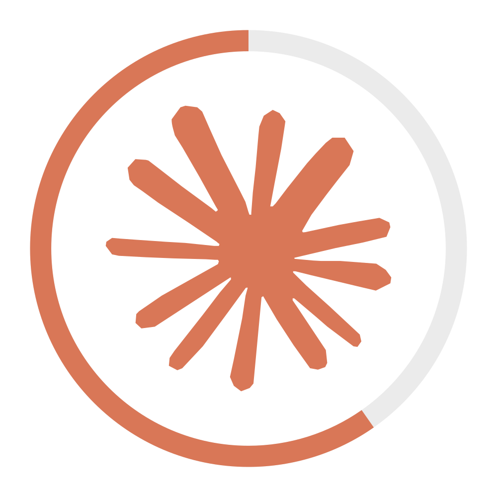

<p align="center">
  
</p>

# Spark

A native macOS menu bar app that shows your Claude Code usage at a glance — color-coded, always visible, zero friction.


---

> [!NOTE]
> Spark reads the OAuth token stored by Claude Code CLI in the macOS Keychain. No browser session cookies, no web scraping, no extra setup beyond a working `claude auth login`.

---

## ✨ Features

- **Usage ring** in the menu bar that fills like a pie chart — color shifts green → orange → red as you approach your limit
- **Session & Weekly usage** with progress bars and countdown timers to the next reset
- **Session projection** that estimates whether you'll hit the limit before the reset window closes
- **Usage history graph** with time-proportional rendering, hover tooltips, and selectable ranges (1h / 6h / 1d / 7d / 30d)
- **Today's stats** — message count, session count, and token totals at a glance
- **Claude service status** pulled from `status.anthropic.com` — only surfaces when there's an active incident
- **Native notifications** for warning thresholds, critical levels, limit resets, and service incidents
- **Smart refresh** that adapts polling from 5 min (active) down to 30 min (idle) and snaps back instantly when usage changes
- **Customizable icon** — Minimal ring, Dot, or Claude Logo style; colored or monochrome
- **Auto-connect** via Claude Code CLI credentials stored in macOS Keychain

## 🔥 Installation

### Build from Source

```bash
git clone https://github.com/konradmichalik/spark.git
cd spark
brew install xcodegen
xcodegen generate
open Spark.xcodeproj
```

Then in Xcode:

1. Select your development team under **Signing & Capabilities**
2. Press **Cmd+R** to build and run

### Requirements

- macOS 14.0 (Sonoma) or later
- [Claude Code CLI](https://docs.anthropic.com/en/docs/claude-code) installed and authenticated
- Xcode 16+ (build only)

## 🚀 Getting Started

Spark auto-detects your Claude Code credentials on first launch. If the connection doesn't happen automatically:

1. Click the menu bar icon to open the popover
2. Go to **Settings → Connection**
3. Click **Load Credentials**

If you haven't authenticated with Claude Code yet:

```bash
claude auth login
```

> [!TIP]
> After a successful `claude auth login`, Spark will pick up the credentials automatically on the next refresh — no restart needed.

## 💡 Usage

### Menu Bar Icon

The icon reflects your highest current usage level:

| Color | Meaning |
|-------|---------|
| Green | Below warning threshold (default < 75%) |
| Orange | Warning level (default 75–90%) |
| Red | Critical level (default > 90%) |

Click the icon to open the detailed popover with usage stats, the history graph, and service status.

### Settings

| Tab | Description |
|-----|-------------|
| **General** | Refresh mode (smart / fixed interval), launch at login |
| **Appearance** | Icon style, displayed value (highest / session / weekly), monochrome toggle |
| **Connection** | Manage Claude Code CLI authentication |
| **Notifications** | Warning and critical thresholds, per-event toggles, test notification |
| **Status** | Live status of all Claude service components |
| **About** | Version info and project link |

### Smart Refresh

| Tier | Interval | Trigger |
|------|----------|---------|
| Active | 5 min | Usage is changing |
| Idle | 10 min | No change for 3 cycles |
| Idle+ | 15 min | No change for 6 cycles |
| Sleep | 30 min | No change for 10+ cycles |

> [!TIP]
> Smart refresh drops back to **Active** instantly the moment a usage change is detected, so you never miss a spike.

## ⚙️ How It Works

Spark queries `api.anthropic.com/api/oauth/usage` using the OAuth token Claude Code CLI stores in the macOS Keychain via `KeychainService`. Service status is fetched from `status.anthropic.com/api/v2/summary.json`. All network calls run on a background actor; the UI updates on the main thread via `@Observable` state.

## 📁 Project Structure

```
Spark/Sources/
  App/        SparkApp.swift — entry point, menu bar controller
  Models/     Models.swift, AppState.swift, StatsModels.swift
  Services/   UsageClient.swift, KeychainService.swift
  Views/      MenuBarView, UsageGraphView, SettingsView, ClaudeLogoShape
```

> [!NOTE]
> The project uses [XcodeGen](https://github.com/yonaskolb/XcodeGen) (`project.yml`) so the `.xcodeproj` is fully derived — never edit it by hand.

## 🐛 Troubleshooting

**No data / "Not connected" state**
Run `claude auth login` to ensure valid credentials exist, then use **Settings → Connection → Load Credentials**.

**Usage figures look stale**
Check the refresh mode in **Settings → General**. In Smart mode, the interval can stretch to 30 min during idle periods. Switch to a fixed interval if you need more frequent updates.

> [!WARNING]
> Spark relies on an undocumented internal API endpoint. Anthropic may change or remove it without notice. If data stops loading after a CLI update, check for a new Spark release.

## 🧑‍💻 Contributing

Pull requests are welcome. For larger changes, open an issue first to discuss the approach.

```bash
# Generate the Xcode project after changing project.yml
xcodegen generate

# Run SwiftLint
swiftlint
```

> [!IMPORTANT]
> Do not commit the generated `.xcodeproj` contents — only `project.yml` is the source of truth for project configuration.

## 📜 License

MIT
