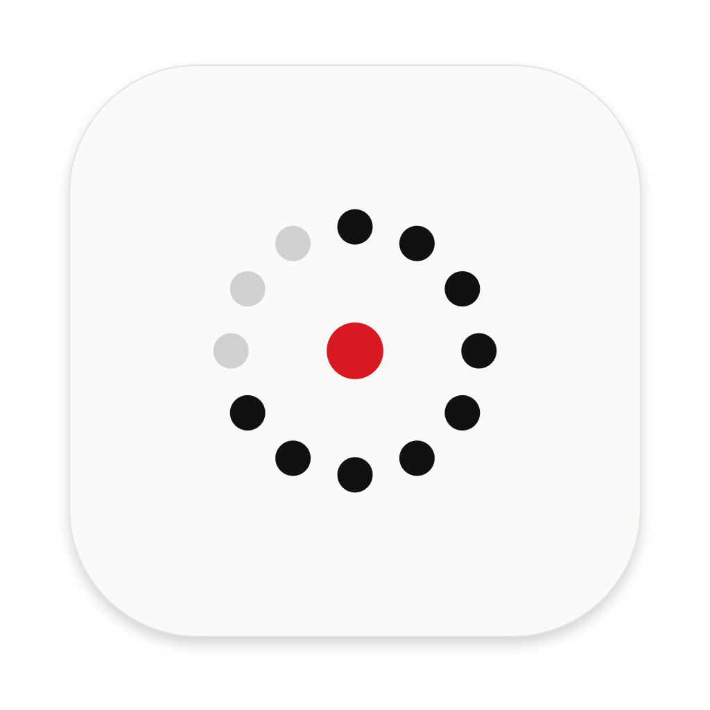
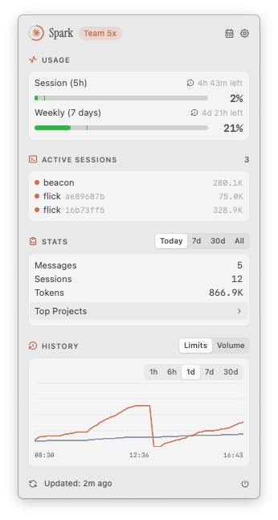

<div align="center">



# Spark

A native macOS menu bar app that shows your Claude Code usage at a glance, color-coded, always visible, zero friction.<br>
Learn more at <a href="https://konradmichalik.github.io/spark/">konradmichalik.github.io/spark</a>

<p>
  
  
  
</p>



</div>

---

## ✨ Features

- **Usage ring** in the menu bar that fills based on current usage: ring color shifts green → orange → red as you approach your limit
- **Account tier badge** showing your plan (Pro, Max, Team, etc.) directly in the popover header
- **Session, Weekly, Sonnet, Opus & Fable usage** with progress bars, countdown timers to the next reset, a six-tier color-coded pace marker (Comfortable → Runaway) showing whether you're tracking ahead of or behind an even-pace budget, and a pay-as-you-go extra-usage line when you exceed plan limits
- **Session projection** that estimates whether you'll hit the limit before the reset window closes, plus a live **burn rate** (fresh tokens per minute over the last 15 minutes, read from your local transcripts) that reacts before the next API poll
- **Usage history graph** with two modes: **Limits** (time-proportional utilization line chart, selectable 1h–30d) and **Volume** (daily token bar chart from permanent history, 7d/30d), both with hover tooltips
- **Stats for any period** (Today / 7d / 30d / All): message count, session count, token totals, local per-model (Sonnet/Opus/Fable) attribution, and a collapsible **Top Projects** breakdown by token volume, plus the optional API cost estimate for the period and per project
- **Active Sessions**: see which Claude Code sessions have had activity in the last 5 minutes, by project
- **Usage Report** window, switchable between week and calendar-month view and navigable back one period at a time: tokens, the change against the period before and an optional API cost estimate (off by default, see Settings), a pace graph with each day's session peak as dot columns and the week as a line, a dotted activity calendar of the days with use, a Claude | Codex | All filter for the whole report when Codex is signed in, each model's share, a cache hit rate warning when caching breaks, and top projects and top sessions that expand with "Show more"
- **Claude service status** pulled from `status.anthropic.com`, surfacing only when there's an active incident
- **Native notifications** for warning thresholds, critical levels, limit resets, and service incidents, titled by provider and window (`Claude · Session at 78%`), with a dot ring in the state's colour and one Notification Center thread per provider. A click opens the popover on that provider's tab
- **Smart refresh** that reacts to your actual Claude Code activity: watches your transcripts directly and snaps back to active polling the moment you start working, instead of waiting for the next scheduled check
- **Codex usage** _(automatic when available)_: if the [Codex CLI](https://github.com/openai/codex) is signed in with ChatGPT, a Claude | Codex switch appears in the popover with Codex's plan limits, credits and local session stats, and the menu bar shows the provider of the selected tab
- **Menu bar ring**: twelve dots that fill with usage, as a ring alone or with the provider logo in front
- **Auto-connect** via Claude Code CLI credentials from macOS Keychain
- **Data export** _(opt-in)_: write live usage state to a local JSON file for external consumers such as a Stream Deck plugin, enabled in **Settings → General**

## 🔥 Installation

### Homebrew

<a href="https://github.com/konradmichalik/homebrew-tap"></a>
<a href="https://github.com/konradmichalik/homebrew-tap"></a>

```bash
brew tap konradmichalik/tap
brew install spark
```

### Update

```bash
brew upgrade --cask konradmichalik/tap/spark
```

### Requirements

- macOS 14.0 (Sonoma) or later
- [Claude Code CLI](https://docs.anthropic.com/en/docs/claude-code) installed and authenticated

## ⚙️ Configuration

Spark auto-detects your Claude Code credentials on first launch. If the connection doesn't happen automatically:

1. Click the menu bar icon to open the popover
1. Go to **Settings → Connections**
1. Click **Load from keychain** on the Claude Code card

If you haven't authenticated with Claude Code yet:

```bash
claude auth login
```

> [!TIP]
> After a successful `claude auth login`, Spark picks up the credentials automatically on the next refresh. No restart needed.

<!-- -->

> [!NOTE]
> Spark reads the OAuth token stored by Claude Code CLI in the macOS Keychain: no browser session cookies, no web scraping, no extra setup beyond a working `claude auth login`. On first launch, macOS asks for your login password to grant Spark access to it; this is a one-time prompt, and Spark remembers the permission afterward.

### Codex

Codex needs no setup in Spark. Once `codex login` has stored a ChatGPT sign-in in `~/.codex/auth.json` (or `$CODEX_HOME/auth.json`), Spark shows Codex next to Claude. The menu bar shows the provider of the popover tab you opened last. Turn Codex off with the switch on its card under **Settings → Connections**.

> [!NOTE]
> Spark only reads `auth.json` and never refreshes or rewrites the Codex token, so it cannot sign the CLI out. Not supported yet: sign-ins stored in the Keychain (`cli_auth_credentials_store = keyring`), using Codex without a Claude Code connection, and a `CODEX_HOME` set only in your shell profile (apps started from Finder or as a login item don't see it, so Spark falls back to `~/.codex`).

## 🐛 Troubleshooting

**No data / "Not connected" state**
Run `claude auth login` to ensure valid credentials exist, then use **Settings → Connections → Load from keychain**.

**Usage figures look stale**
Check the refresh mode in **Settings → General**. In Smart mode, the interval can stretch to 30 min during idle periods. Switch to a fixed interval if you need more frequent updates.

**No Codex tab**
Run `codex login` and sign in with ChatGPT (API-key sign-ins have no plan limits to show), then use **Check again** on the Codex card under **Settings → Connections**.

## 🧑‍💻 Contributing

Please have a look at [`CONTRIBUTING.md`](CONTRIBUTING.md).

## 💎 Credits

Icons by [Tabler Icons](https://tabler.io/icons), licensed under the MIT License.

Bundles the [Doto](https://fonts.google.com/specimen/Doto) font by The Doto Project Authors, licensed under the SIL Open Font License 1.1.

## ⭐ License

This project is licensed under [MIT](LICENSE).
